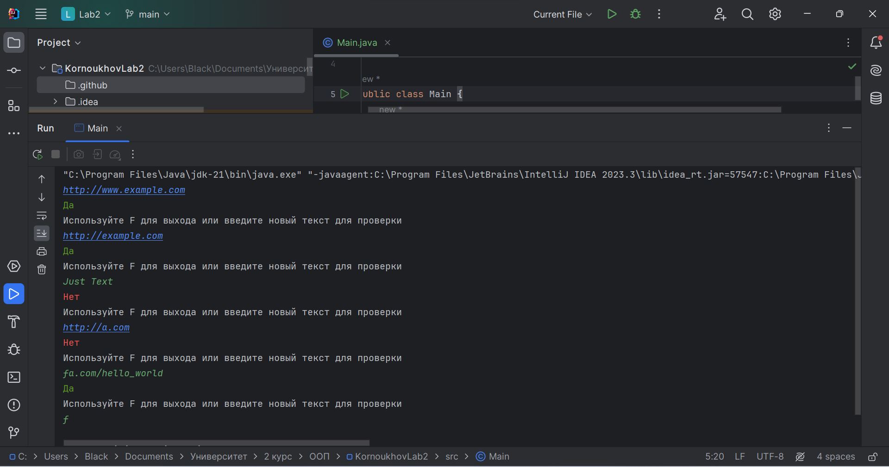

# Лабораторная работа №2
По дисциплине "Объектно-ориентированное программирование".

Выполнил студент группы ПИН-222 Корноухов Роман.

**Вариант 4.** Написать регулярное выражение, определяющее является ли данная строчка валидным URL адресом. В данной задаче правильным URL считаются адреса http и https, явное указание протокола также может отсутствовать. Учитываются только адреса, состоящие из символов, т.е. IP адреса в качестве URL не присутствуют при проверке. Допускаются поддомены, указание порта доступа через двоеточие, GET запросы с передачей параметров, доступ к подпапкам на домене, допускается наличие якоря через решетку. Однобуквенные домены считаются запрещенными. Запрещены спецсимволы, например «–» в начале и конце имени домена. Запрещен символ «_» и пробел в имени домена. При составлении регулярного выражения ориентируйтесь на список правильных и неправильных выражений заданных ниже.
– пример правильных выражений: http://www.example.com, http://example.com.
– пример неправильных выражений: Just Text, h

